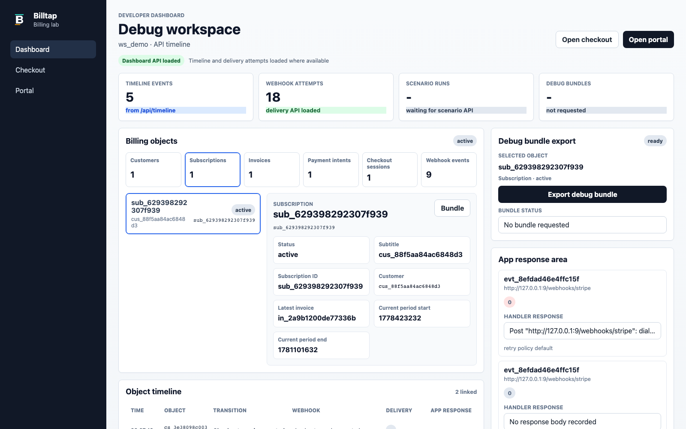
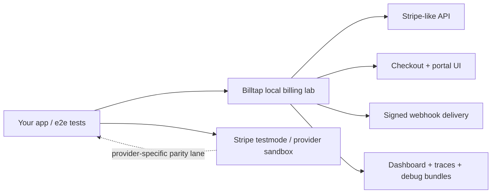

# Billtap

Full-stack Stripe-style billing sandbox for local development, CI scenarios,
and controlled staging checks.

Billtap gives subscription teams a local billing lab: a Go server, practical
Stripe-like API subset, React checkout/portal/dashboard surfaces, signed webhook
delivery controls, YAML scenario runs, fixture apply/snapshot/assert APIs, and
diagnostic bundles that explain what happened when a billing test failed.

It is **not** a payment processor and it is **not** full Stripe parity. Use it as
the fast deterministic lane, then keep Stripe testmode or the real provider
sandbox as the high-fidelity fallback lane.



## What You Get

| Surface | What it is for |
| --- | --- |
| Stripe-like API | Local customers, products, prices, coupons, promotion codes, checkout sessions, subscriptions, schedules, invoices, payment intents, cash balance, refunds, credit notes, disputes, test clocks, webhook endpoints, and events for supported billing flows. |
| Hosted checkout | Browser-visible sandbox checkout for exercising app integration and deterministic payment outcomes. |
| Billing portal | Local customer portal for plan changes, seats, cancellation, resume, and payment-method update flows. |
| Developer dashboard | Billing objects, timeline, webhook delivery attempts, app responses, and debug bundle export in one place. |
| Webhook lab | Signed delivery with retry, duplicate, delay, out-of-order, grouped replay, masking, and delivery evidence. |
| Fixtures and scenarios | JSON/YAML setup, structured assertions, SaaS workspace profiles, and CI-readable reports. |
| Diagnostics | Request traces and bundles that help agents distinguish app misconfiguration, unsupported API calls, webhook failures, and wrong local state. |

## Testing Model



Use two lanes instead of forcing one tool to satisfy every billing test:

- **Default lane:** Billtap-backed local development, isolated e2e tests, CI
  regression scenarios, fixture setup, and webhook reliability tests.
- **Fallback lane:** Stripe testmode or the real provider sandbox for
  provider-specific behavior, hosted-provider parity, settlement, risk, tax,
  invoice rendering, and final compatibility checks.

For the exact supported surface, see `docs/COMPATIBILITY.md`. Anything outside
that contract should be treated as unsupported until it has fixture-backed tests
and documentation. Known but unimplemented Stripe OpenAPI routes return a
Stripe-shaped `unsupported_endpoint` error so test agents can identify coverage
gaps instead of mistaking them for app bugs.

## Good Fit / Bad Fit

| Use Billtap when... | Use a provider sandbox when... |
| --- | --- |
| You need deterministic subscription billing tests in local dev or CI. | You need full Stripe API behavior or hosted Stripe Dashboard parity. |
| You need to validate webhook idempotency, retries, duplicate delivery, delays, or replay. | You are proving settlement, risk, tax, invoice rendering, account, payout, or real dispute behavior. |
| You want fixture-driven setup with easy snapshot/assert APIs. | You need live provider validation for a newly adopted endpoint. |
| You need a local checkout/portal/dashboard loop for app integration work. | You are handling real card data, live credentials, or production payment paths. |

## Quick Start

Current distribution state: source plus a GitHub Container Registry image.
No package, Homebrew formula, or signed binary release is published yet.

Requirements:

- Go 1.25+ (`go.mod`); currently verified with Go 1.26.1
- Node.js 20+ and npm; currently verified with Node 24.14.0 and npm 11.9.0
- Docker, optional for image smoke checks

Build and run locally:

```bash
npm ci
npm run build
go run ./cmd/billtap
```

Open:

```text
http://localhost:8080
```

Run a scenario with the sample app assertion endpoint:

```bash
PORT=3300 npm --prefix examples/sample-app start
```

In another terminal:

```bash
go run ./cmd/billtap scenario run examples/subscription-payment-retry.yml \
  --report-json billtap-report.json \
  --report-md billtap-report.md
```

Run the generic SaaS workspace scenario:

```bash
go run ./cmd/billtap scenario run examples/saas-adoption-contract.yml
```

Build a local image:

```bash
docker build -t billtap:local .
docker run --rm -p 8080:8080 -v billtap-data:/data billtap:local
```

Use the published container image:

```bash
docker run --rm -p 8080:8080 -v billtap-data:/data ghcr.io/midagedev/billtap:main
```

Image tags:

- `ghcr.io/midagedev/billtap:main`: latest successful `main` build
- `ghcr.io/midagedev/billtap:sha-<short-sha>`: immutable commit build
- `ghcr.io/midagedev/billtap:<version>`: release tag builds such as `0.1.0`

Images are published for `linux/amd64` and `linux/arm64`.

## Fixture And Assertion APIs

Billtap includes local integration-test helpers:

- `POST /api/fixtures/apply`: apply JSON/YAML customers, catalog, test clocks, subscriptions, refunds, credit notes, and assertions
- `GET /api/fixtures/resolve`: resolve a fixture `ref`, explicit ID, or lookup key to the local customer, subscription, invoice, payment intent, checkout session, product, and price IDs
- `GET /api/fixtures/snapshot`: read a filtered fixture-scoped billing snapshot
- `POST /api/fixtures/assert`: assert expected customer, product, price, subscription, invoice, payment intent, and timeline state

Fixture-applied subscriptions use the normal checkout-completion path so invoices, payment intents, checkout sessions, and timeline evidence stay consistent.
Fixture-provided object IDs are preserved where the fixture supplies them, and
every created object is tagged with `billtap_fixture_ref` metadata so local E2E
tests can find the seeded graph without relying on random IDs.

Subscription fixture lifecycle fields are authoritative. If a subscription
fixture sets `status`, that status wins over `outcome` for the final seeded
subscription state. This lets a fixture use `outcome: payment_succeeded` to
build checkout, invoice, and payment-intent evidence while still seeding
`trialing`, `canceled`, `past_due`, `unpaid`, `incomplete`, or
`incomplete_expired`. Explicit `current_period_start`, `current_period_end`,
`trial_start`, `trial_end`, `canceled_at`, and `ended_at` values are applied as
absolute times and are restored on re-apply. For `trialing`, attach a
`test_clock` to the customer or subscription and set `trial_end`; advancing the
clock past that timestamp emits the local trial-to-active update evidence.

## Diagnostic APIs

Billtap records Stripe-like `/v1` and `/v2` API requests as redacted request traces.
This is designed for local dev servers and isolated e2e jobs where an agent
needs to answer whether the app was configured to call Billtap, what it asked
for, what Billtap returned, and whether webhooks were emitted and delivered.

- `GET /api/request-traces`: inspect recent Stripe-like method, path, query, status,
  idempotency key, masked headers, redacted request/response evidence, Stripe
  error fields, and related billing object IDs
- `GET /api/diagnostics`: export a single diagnostic bundle with object state,
  fixture snapshot, timeline, request traces, webhook events, and delivery
  attempts
- `POST /api/debug-bundles`: target one customer, checkout session,
  subscription, invoice, or payment intent; debug bundles now include matching
  request traces as well as timeline and webhook evidence

Example:

```bash
curl -fsS "http://localhost:8080/api/diagnostics?limit=100" \
  -o billtap-diagnostics.json
```

## Compatibility Snapshot

| Area | Current level | Notes |
| --- | --- | --- |
| Runtime | Go server with SQLite local default | In-memory storage exists for tests |
| Frontend | React checkout, portal, and dashboard apps | Built with Vite into `dist/app` |
| Stripe-like API | Practical local subset | Customers, catalog, checkout, portal sessions, subscriptions, schedules, invoices, payment intents, cash balance, refunds, credit notes, disputes, test clocks, webhook endpoints, events, search/list projections used by tests |
| Webhooks | Signed delivery with reliability controls | Retry, duplicate, delay, out-of-order, grouped replay, endpoint attempts, delivery evidence, redaction |
| Scenarios | YAML runner | Local clock, app assertions, JSON/Markdown reports, exit-code policy |
| Fixtures | Apply/snapshot/assert APIs | JSON/YAML input, fixture metadata isolation, structured pass/fail reports |
| SaaS profile | Generic workspace billing profile | Plans, seats, members, export quota, extra export, payment history, support bundle, platform/connect-style webhook evidence |
| Release state | Source plus GHCR image | Local Docker image builds and GHCR image workflow; no package/Homebrew/signed binary yet |

Detailed compatibility matrix: `docs/COMPATIBILITY.md`.

## Known Limitations

- This is not full Stripe compatibility.
- It does not process real payments and rejects real card-data fields.
- Hosted UI behavior is a sandbox approximation, not a Stripe-hosted UI clone.
- Dashboard access control is not a production security boundary.
- Relay mode is only for controlled testmode or staging-adjacent debugging and stores raw payloads as metadata-only.
- Package, Homebrew, and signed binary releases are not published yet.

## Development Commands

```bash
go test ./...
go run ./cmd/billtap compatibility scorecard --output-dir /tmp/billtap-compatibility
npm run typecheck
npm run build
npm run smoke:sample
npm run smoke:sdk
npm run smoke:web:install
npm run smoke:web
go build -o /tmp/billtap ./cmd/billtap
docker build -t billtap:local .
```

Scenario smoke, with `PORT=3300 npm --prefix examples/sample-app start` running:

```bash
go run ./cmd/billtap scenario run examples/subscription-payment-retry.yml
go run ./cmd/billtap scenario run examples/saas-adoption-contract.yml
```

## Documentation

- Documentation index: `docs/README.md`
- Product goal: `docs/FINAL_GOAL.md`
- Architecture: `docs/ARCHITECTURE.md`
- Compatibility: `docs/COMPATIBILITY.md`
- SaaS profile: `docs/SAAS_PROFILE.md`
- Testing: `docs/TESTING.md`
- Production boundaries: `docs/PRODUCTION_BOUNDARIES.md`
- Release process: `docs/RELEASE.md`
- Release checklist: `docs/RELEASE_CHECKLIST.md`
- Public release readiness: `docs/PUBLIC_RELEASE_READINESS.md`
- Roadmap: `docs/ROADMAP.md`
- Scenario contract: `specs/000-product/contracts/scenario.md`
- API contract: `specs/000-product/contracts/api.md`
- Webhook contract: `specs/000-product/contracts/webhooks.md`
- Changelog: `CHANGELOG.md`
- Contributing: `CONTRIBUTING.md`
- Code of conduct: `CODE_OF_CONDUCT.md`
- Support: `SUPPORT.md`
- Security: `SECURITY.md`

## Community And Support

Before opening an issue or pull request, read `CONTRIBUTING.md` and `SUPPORT.md`. Security reports and production-boundary bypasses should follow `SECURITY.md` rather than public issues.

Public reports and examples must be sanitized. Do not include real card data, live credentials, production customer data, private company data, or production payment payloads.

## Release Process

Public release procedure: `docs/RELEASE.md`.

Maintainer checklist summary:

1. Run the development commands above.
2. Run the scenario smoke commands above.
3. Build and smoke the local Docker image.
4. Confirm `docs/COMPATIBILITY.md` matches the implemented API surface.
5. Confirm the public-surface scan is clean and `.private/` is ignored.
6. Tag the release as `vX.Y.Z`.
7. Publish the package or signed binary only after that release automation is explicitly added.

## License

Billtap is licensed under the Apache License, Version 2.0. See `LICENSE` and
`NOTICE`.
