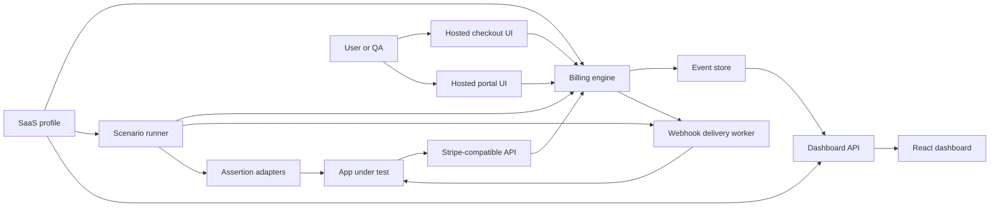

# Architecture

## Summary

Billtap is a Go backend with an embedded React dashboard and hosted customer-facing sandbox UIs.



## Runtime Components

### API server

Go HTTP server exposing Stripe-compatible endpoints and Billtap dashboard APIs.

### Billing engine

State machine for customers, checkout sessions, subscriptions, invoices, payment intents, and events.

### Profile engine

Maps generic billing objects into app-specific domain state. The initial app-specific profile is `saas`, covering workspaces, members, seats, export entitlement, extra export payments, payment history, back-office support actions, and platform/connect webhook evidence.

### Hosted checkout UI

React UI that simulates checkout completion, payment failure, 3DS-like action, cancellation, and plan selection.

### Hosted portal UI

React UI that simulates plan change, cancellation, payment method update, seat changes, and invoice view.

### Webhook delivery worker

Delivers signed webhook events to configured endpoints. Supports retry, delay, duplicate, out-of-order, and replay.

### Scenario runner

Runs scenario files in local or CI mode. Can advance local clock and assert expected results.

### Dashboard

Developer-facing React UI for billing objects, timelines, webhook deliveries, scenario runs, app assertions, and debug bundles.

## Storage

Initial default:

- SQLite for local app state
- in-memory option for unit tests

Tables:

- customers
- products
- prices
- checkout_sessions
- subscriptions
- invoices
- payment_intents
- webhook_endpoints
- events
- delivery_attempts
- scenario_runs
- assertions
- workspaces
- workspace_members
- entitlement_snapshots
- export_sessions
- extra_export_payments
- support_actions
- profile_events
- audit_log

## Backend Module Boundaries

```text
internal/
  api/
  billing/
  checkout/
  portal/
  webhooks/
  scenarios/
  assertions/
  profiles/
    saas/
  entitlements/
  storage/
  dashboard/
  config/
```

## Frontend Module Boundaries

```text
web/
  checkout/
  portal/
  dashboard/
  shared/
```

## Packaging

One Docker image:

- Go binary
- embedded or served React assets
- SQLite local volume

## Security Boundaries

- No real card processing
- Test card numbers only as symbolic inputs
- Webhook secrets are local or test secrets
- Dashboard must mask secrets by default
- Production relay mode must not store real payment payloads by default
